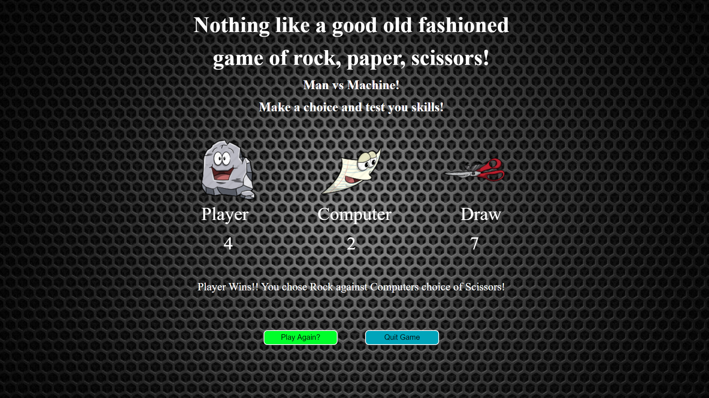

<h1>Rock, Paper, Scissors Game with Vanilla Javascript </h1>

Built a Rock, Paper, Scissors Game with HTML, CSS, Vanilla Javascript nad Flexbox

You can check it out [here](https://jerryvw.github.io/rps-game/)

<h2>Summary</h2> 

Building this rock, paper, scissors game brought about some new challenges with manipulating classes to change images and my first time using the switch statement. I also got a taste of trying to get scores to increment and learned a valuable lesson on parameters and arguments when it comes to functions.
 

I got more practice on getting things to appear and diappear by manipulating the DOM. Once I got all the functionality working properly I just kept wanting to add new features with changing the messages on the screeen and who was the overall winner when you choose to quite the game.

<h2>Author</h2>

**JerryVander Weide** - Full-Stack Developer [My Website](https://jerryvw.github.io/jerryvanderweide-site/) & [LinkedIn](https://www.linkedin.com/in/jerry-vander-weide-ba0586101/)